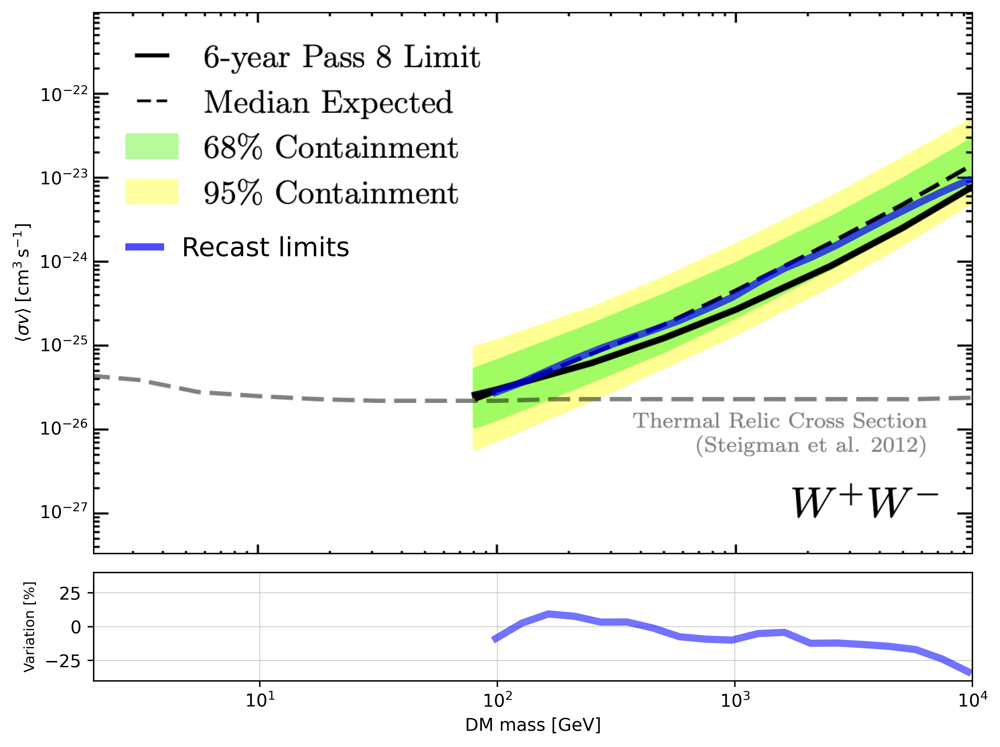

# Recasting Fermi Upper Limits Notebook

This notebook reproduces the **recasting** of published Fermi upper limits (ULs) on dark-matter (DM) annihilation channels.

In particular we will use as an example, the ULs of the following Fermi publication

Ackermann, M., et al. "Searching for dark matter annihilation from Milky Way dwarf spheroidal galaxies with six years of Fermi Large Area Telescope data." Physical review letters 115.23 (2015): 231301.

https://arxiv.org/pdf/1503.02641 Figure 8


> Tip: Run the notebook top-to-bottom from a fresh kernel to ensure reproducibility.


## Imports & Setup <a id='Imports-Setup'></a>


```python
# --- Imports & Setup: see preceding markdown for context ---
import numpy as np
import astropy.units as u
import matplotlib.pyplot as plt
import matplotlib.image as mpimg
from astropy.table import Table
from scipy  import optimize
from scipy  import integrate
```

## Gammapy PrimaryFlux
gammapy version 1.2


```python
from gammapy.astro.darkmatter import  PrimaryFlux
```

## Recast Class <a id='Helper-Functions'></a>


```python
class Recast_ULs:
    """
    Recast published upper limits (ULs) from one DM annihilation channel/model to another,
    using the approximate IRF-free procedure based on photon yields integrated per energy bin.

    This class estimates the (unknown) per-bin coefficients proportional to A_eff / sqrt(b)
    — encoded here as a relative vector V — by *fitting* them with two benchmark channels.
    Once those coefficients are inferred, it applies the ratio formula to
    recast the ULs from a reference channel to a target channel.

    Parameters
    ----------
    DM_masses : astropy.units.Quantity
        Array of DM masses (bin centers), with units convertible to GeV.
        Assumed sorted ascending and *defining* the reconstructed-energy binning used in the ULs.
    UL_values : np.ndarray
        Published upper limits (ULs) for the reference channel/model M0, one value per mass bin.
        Shape: (n_bins,).
    spectral_model_in : list
        List of spectral models (callables with `.evaluate(energy)`) for the **reference** channel M0,
        one per mass bin. Each returns dN/dE with units 1/GeV when evaluated on energies.
    spectral_model_out : list
        List of spectral models (same interface) for the **target** channel M1,
        one per mass bin, producing dN/dE for that bin's DM mass hypothesis.
    spectral_model_in2 : list
        List of spectral models for the **second benchmark** channel M2
        (used only to *fit* the V coefficients against UL_values_2).
    UL_values_2 : np.ndarray
        Published ULs for the second benchmark channel M2, one per mass bin.

    Notes
    -----
    - This implementation follows the approximate recasting in which the instrument
      information (A_eff, energy-dispersion, bkg) enters *only* through a per-bin factor
      proportional to A_eff / sqrt(b). The relative vector V is fitted using the
      ratio of ULs between two channels (M0 and M2), then reused to recast M0 -> M1.
    - The energy binning is inferred from the provided DM_masses by constructing borders
      in log-space and using geometric means as bin centers.
    - Each spectral model is evaluated on a fine grid inside each bin and integrated
      with Simpson's rule to obtain ΔN_gamma per bin.
    - All energies are handled in GeV; dN/dE is converted to 1/GeV before integration.
    """

    def __init__(self,
                 DM_masses,
                 UL_values,
                 spectral_model_in,
                 spectral_model_out,
                 spectral_model_in2,
                 UL_values_2):

        # --- Units and inputs
        self.energy_unit = u.GeV

        # Convert masses to GeV (float array)
        self.DM_masses          = DM_masses.to(self.energy_unit).value
        self.UL_values          = np.asarray(UL_values)
        self.spectral_model_in  = spectral_model_in     # reference channel (M0)
        self.spectral_model_out = spectral_model_out    # target channel    (M1)
        self.UL_values_2        = np.asarray(UL_values_2)
        self.spectral_model_in2 = spectral_model_in2    # second benchmark  (M2)

        # --- Build energy bin borders/centers from mass grid (log-uniform assumption)
        # Infer a "left border" by extrapolating the first log-step backward
        logm      = np.log10(self.DM_masses)
        self.emin = 10**(logm[0] - np.diff(logm)[0])

        # Borders: [emin, m0, m1, ..., m_{n-1}]
        self.energy_borders = np.concatenate(([self.emin], self.DM_masses))
        # Centers as geometric mean of adjacent borders
        self.energy_centers = np.sqrt(self.energy_borders[1:] * self.energy_borders[:-1])

        # --- Precompute ΔN_gamma for each bin and for each model list
        # The matrices store, for each mass bin i, the integral of dN/dE over all bins j
        # (diagonal dominates if spill-over is negligible). Here we assume per-row = per-mass.
        n = len(self.energy_centers)
        self.Ngamma_in   = np.empty((n, n))  # for M0 (reference)
        self.Ngamma_out  = np.empty((n, n))  # for M1 (target)
        self.Ngamma_in2  = np.empty((n, n))  # for M2 (second benchmark)

        # Use a fine geometric grid inside each energy bin for robust integration
        x_values = np.geomspace(self.energy_borders[:-1], self.energy_borders[1:], 1000)

        for i in range(n):
            # Integrate ΔN_gamma for each row (mass bin i) over all bins j
            # Assumption: spectral_model_*[i] corresponds to DM mass in bin i.
            y_values = self.spectral_model_in[i].evaluate(x_values * self.energy_unit).to(1 / self.energy_unit).value
            self.Ngamma_in[i, :] = integrate.simpson(y_values, x=x_values, axis=0)

            y_values = self.spectral_model_in2[i].evaluate(x_values * self.energy_unit).to(1 / self.energy_unit).value
            self.Ngamma_in2[i, :] = integrate.simpson(y_values, x=x_values, axis=0)

            y_values = self.spectral_model_out[i].evaluate(x_values * self.energy_unit).to(1 / self.energy_unit).value
            self.Ngamma_out[i, :] = integrate.simpson(y_values, x=x_values, axis=0)

        # Numerical safety: negative integration artifacts are clipped to zero
        self.Ngamma_in[self.Ngamma_in < 0]     = 0.0
        self.Ngamma_out[self.Ngamma_out < 0]   = 0.0
        self.Ngamma_in2[self.Ngamma_in2 < 0]   = 0.0

        # --- Fit the relative per-bin coefficients (A_eff / sqrt(b)) up to a global factor
        # We set the first bin coefficient to 1 and fit the remaining n-1 entries ≥ 0.
        initial_guess = np.ones(n - 1)

        # Target = UL(M2)/UL(M0) (per bin), used to find V such that
        # sqrt(sum K0^2 / sum K2^2) matches this ratio in each mass bin.
        target = self.UL_values_2 / self.UL_values

        self.result = optimize.least_squares(
            self.residuals,
            initial_guess,
            args=(self.Ngamma_in, self.Ngamma_in2, target),
            bounds=(0, np.inf)  # enforce non-negativity
        )

        # Full coefficient vector: first entry fixed to 1 by convention (sets overall scale)
        self.V = np.concatenate(([1.0], self.result.x))

        # --- Compute the fraction of K's needed to recast UL(M0) -> UL(M1)
        fraction_of_Ks = self.compute_fraction_of_Ks(self.Ngamma_in, self.Ngamma_out, self.V)

        # Final recasted ULs for the target channel M1
        self.recasted_ULs = fraction_of_Ks * self.UL_values

    def compute_fraction_of_Ks(self,
                               Ngamma_in: np.ndarray,
                               Ngamma_out: np.ndarray,
                               V: np.ndarray) -> np.ndarray:
        """
        Compute the per-mass-bin factor:
            sqrt( sum_j (K_in[j]^2) / sum_j (K_out[j]^2) )
        using K ∝ ΔN_gamma * (A_eff / sqrt(b)) per bin.

        Parameters
        ----------
        Ngamma_in : np.ndarray
            Matrix of ΔN_gamma for the reference channel M0, shape (n_bins, n_bins).
        Ngamma_out : np.ndarray
            Matrix of ΔN_gamma for the target channel M1, shape (n_bins, n_bins).
        V : np.ndarray
            Vector of per-bin coefficients proportional to A_eff / sqrt(b),
            length n_bins. First element defines the overall scale.

        Returns
        -------
        np.ndarray
            Array of multiplicative factors (length n_bins) to recast ULs
            from M0 to M1 for each mass bin.
        """
        # sum_j [ (ΔN_gamma_in[i, j] * V[j])^2 ]
        summed_K_in  = np.sum((Ngamma_in  * V[np.newaxis, :])**2, axis=1)
        summed_K_out = np.sum((Ngamma_out * V[np.newaxis, :])**2, axis=1)

        return np.sqrt(summed_K_in / summed_K_out)

    def residuals(self,
                  V_reduced: np.ndarray,
                  Ngamma_in: np.ndarray,
                  Ngamma_out: np.ndarray,
                  target: np.ndarray) -> np.ndarray:
        """
        Residuals for the least-squares fit of the V vector (except the first bin).

        We define V = [1, a_1, ..., a_{n-1}] and solve for a_k >= 0 such that:
            compute_fraction_of_Ks(Ngamma_in, Ngamma_out, V) ≈ target,
        with target = UL(M2)/UL(M0) for each mass bin.

        Parameters
        ----------
        V_reduced : np.ndarray
            Optimization variable for bins [1..n-1]; bin 0 is fixed to 1.
        Ngamma_in : np.ndarray
            ΔN_gamma for M0 (reference), shape (n_bins, n_bins).
        Ngamma_out : np.ndarray
            ΔN_gamma for M2 (second benchmark), shape (n_bins, n_bins) — used for fitting.
        target : np.ndarray
            Ratio UL(M2)/UL(M0) per mass bin (length n_bins).

        Returns
        -------
        np.ndarray
            Residual vector to be minimized (length n_bins).
        """
        # Rebuild full vector with the first element fixed to 1 (sets scale)
        V = np.concatenate(([1.0], V_reduced))

        # Predicted ratio per mass bin for M0 -> M2, to match the published UL ratio
        pred = self.compute_fraction_of_Ks(Ngamma_in, Ngamma_out, V)

        # Residuals = predicted - target (element-wise)
        return pred - target
```

# Case we consider:
- channel to recast =   $W^+ W^-$
- benchmark channek =   $b \bar{b}$
- second benchmark channek =   $\tau^+ \tau^-$

## Load Data


```python
# --- Load published Fermi ULs for the reference channel (bb) and
#     interpolate them to a common DM mass grid --------------------

# Read ECSV table with columns: [mass, UL] for Coma Berenices (bb channel)
t = Table.read('Limits/fermi_bb_median.ecsv')

# Extract the DM mass column (astropy Quantity) and sort it ascending (safety)
mDM     = t[t.colnames[0]]
argsort = np.argsort(mDM)
mDM     = mDM[argsort]
mDM     = np.array(mDM) * mDM.unit  # ensure it's a Quantity array with units

# Extract the corresponding UL values (sigma_v upper limits), and sort consistently
sigma   = np.array(t[t.colnames[1]])
sigma   = sigma[argsort]

# Define a **common mass grid** (log-spaced) to which all channels will be interpolated
# Here: from 50 GeV up to the max mass of the bb table, using 12 points
DM_masses = np.geomspace(10 * u.GeV, mDM[-1], 28)

# Interpolate the bb ULs to the common mass grid (work in pure floats, keep units separate)
sigma_in = np.interp(
    DM_masses.to(u.GeV).value,  # x: target grid (GeV)
    mDM.to(u.GeV).value,        # xp: original grid (GeV)
    sigma                        # fp: UL values at xp
)
# NOTE: np.interp assumes xp is increasing (we sorted above). It performs linear interpolation
# in linear space. 


# --- Load second benchmark channel (tau tau) and interpolate to the same grid --------------

t = Table.read('Limits/fermi_tautau_median.ecsv')

mDM     = t[t.colnames[0]]
argsort = np.argsort(mDM)
mDM     = mDM[argsort]

sigma   = np.array(t[t.colnames[1]])
sigma   = sigma[argsort]

sigma_in2 = np.interp(
    DM_masses.to(u.GeV).value,
    mDM.to(u.GeV).value,
    sigma
)


# --- Load the target channel (WW) and interpolate to the same grid ------------------------

t = Table.read('Limits/fermi_WW_median.ecsv')

mDM     = t[t.colnames[0]]
argsort = np.argsort(mDM)
mDM     = mDM[argsort]

sigma   = np.array(t[t.colnames[1]])
sigma   = sigma[argsort]

sigma_out = np.interp(
    DM_masses.to(u.GeV).value,
    mDM.to(u.GeV).value,
    sigma
)

# At this point:
# - DM_masses (Quantity) is the unified mass grid
# - sigma_in  contains ULs for bb on that grid
# - sigma_in2 contains ULs for tau tau on that grid (used to fit A_over_b)
# - sigma_out contains ULs for WW on that grid (used as target comparison)
#
# These three arrays can be passed to Recast_ULs along with the spectral models to
# fit the per-bin coefficients and compute the recasted ULs.
```

## Recasting Computation <a id='Recasting-Computation'></a>


```python
# --- Recasting Computation: bb → W using tau as secondary benchmark -----------------------
# Goal:
#   Recast published ULs from the bb channel (sigma_in) into ULs for the W channel,
#   using the tau channel (sigma_in2) to infer the per-bin coefficients A_eff/sqrt(b)
#   in the IRF-free approximation.

# Choose the *target* channel to recast to (nomenclature: 'W' ≡ W+W-)
channel_to_recast = 'W'

# Build per-mass spectral models dN/dE for:
#   - sp_in:   reference channel (bb), provides the "source" ULs to be recast
#   - sp_out:  target channel (W+W-), where we want the recasted ULs
#   - sp_in_2: second benchmark channel (tau), used ONLY to fit A_over_b coefficients
sp_out  = [PrimaryFlux(mDM=im, channel=channel_to_recast) for im in DM_masses]
sp_in   = [PrimaryFlux(mDM=im, channel='b')              for im in DM_masses]
sp_in_2 = [PrimaryFlux(mDM=im, channel='tau')            for im in DM_masses]

# Instantiate the recaster:
# Inputs:
#   - DM_masses:     common mass grid (Quantity, GeV)
#   - spectral_model_in:   models for reference channel (bb)
#   - spectral_model_out:  models for target channel   (W)
#   - UL_values:           published ULs for reference channel (bb) on the common grid
#   - UL_values_2:         published ULs for second benchmark (tau) on the same grid
#   - spectral_model_in2:  models for second benchmark (tau)
#
# What happens inside:
#   1) ΔN_gamma are integrated per energy bin for each mass and channel.
#   2) A_over_b (∝ A_eff / sqrt(b)) per-bin coefficients are *fitted* so that
#      the predicted bb→tau ratio reproduces the published UL ratio sigma_in2 / sigma_in.
#   3) Those coefficients are then used to compute the bb→W recasting factor and
#      generate recasted ULs for the W channel.
r = Recast_ULs(
    DM_masses=DM_masses,
    spectral_model_in=sp_in,        # reference (bb)
    spectral_model_out=sp_out,      # target (W)
    UL_values=sigma_in,             # ULs for bb
    UL_values_2=sigma_in2,          # ULs for tau (second benchmark)
    spectral_model_in2=sp_in_2      # spectra for tau
)

# Results available as:
#   r.recasted_ULs  → recasted ULs for the W channel on DM_masses grid
#   r.A_ober_b      → fitted per-bin coefficients (relative scale of A_eff/sqrt(b))
#   r.result        → least-squares optimization result (diagnostics)
```

    /var/folders/cc/9yrg3qln5sq119c30p8bh2h00000gn/T/ipykernel_36202/59134382.py:154: RuntimeWarning: divide by zero encountered in divide
      return np.sqrt(summed_K_in / summed_K_out)


## Plot recasting


```python
# --- Plotting & Visualization: overlay recasted ULs on published Fermi figure -------------
# Goal:
#   1) Show our recasted bb → W limits (blue line) on top of the original Fermi plot image.
#   2) Display, in a second (bottom) panel, the relative difference (%) between the
#      recasted limits and the published Fermi W+W− ULs interpolated on our mass grid.

# Load the base image (screenshot of the published Fermi figure 8, W channel)
image_path = './Paper_figures/Fermi_LAT_W.png'
img = mpimg.imread(image_path)

# Create a 2-row figure: top panel = UL curves on top of background image,
# bottom panel = percent variation (recast vs published)
fig, ax = plt.subplots(
    nrows=2, ncols=1, dpi=500, figsize=(8, 6),
    height_ratios=[5, 1], sharex=True
)

# Reduce vertical spacing between the two panels for a tighter look
fig.subplots_adjust(hspace=0.05)

# --- TOP PANEL: recasted ULs overlaid on the published background plot -------------------
# The 'extent' maps the image pixel coordinates into data coordinates (log10 mass, log10 UL).
# These values must match the axes ranges used by the original figure to align correctly.
ax[0].imshow(
    img,
    extent=[np.log10(2.01), np.log10(0.99e4), np.log10(3.1e-28),np.log10(0.95e-21)],
    aspect='auto'
)

# Apply the same (log10) axis limits as the original plot to ensure perfect overlay
ax[0].set_xlim([np.log10(2), np.log10(0.99e4)]) 
ax[0].set_ylim([np.log10(3.1e-28), np.log10(0.95e-21)])  

# Plot the recasted limits (bb → W) as a thick blue line on the log10 axes
ax[0].plot(
    np.log10(DM_masses.to(u.GeV).value),
    np.log10(r.recasted_ULs),
 c='blue', alpha =0.7, label=r'Recast limits', linewidth=4.1 
 )

# Legend styling: place it on transparent background above the image
ax[0].legend(loc=[0.028,0.52], facecolor='none', edgecolor='none',handlelength=1.2,fontsize=15)

# Axis labels (note: values on axes are log10-scaled, displayed as powers of 10 via tick labels)
ax[0].set_ylabel(r'$ \langle \sigma v \rangle \; [\mathrm{cm}^3\,\mathrm{s}^{-1}] $')

# Hide tick marks (keep only tick labels for a clean look over an image)
ax[0].tick_params(axis='both', which='both', length=0)

# Custom ticks in log10 space for both axes
custom_x_ticks = np.log10(np.array([10,100, 1000, 10000]) )
ax[0].set_xticks(custom_x_ticks)
ax[0].set_xticklabels(['$10^1$','$10^2$', '$10^3$', '$10^4$'])

custom_y_ticks = np.log10( [1e-27, 1e-26, 1e-25, 1e-24, 1e-23, 1e-22] )
ax[0].set_yticks(custom_y_ticks)
ax[0].set_yticklabels(['$10^{-27}$' ,'$10^{-26}$', '$10^{-25}$', '$10^{-24}$', '$10^{-23}$', '$10^{-22}$'])


# --- BOTTOM PANEL: percent variation between recast and published ULs --------------------
# Compute the relative difference (in %) between our recasted ULs and the published W ULs
# (sigma_out is the Fermi W+W− UL interpolated on our mass grid).
yy = (r.recasted_ULs - sigma_out) / sigma_out * 100.0


ax[1].plot( np.log10(DM_masses.to(u.GeV).value),
    yy,
    c='blue', alpha=0.55, linewidth=4.1)


# Labels, grid, and sensible y-range for residuals
ax[1].set_xlabel('DM mass [GeV]')
ax[1].set_ylabel('Variation [%]', fontsize=8)
ax[1].grid(linewidth=0.3)
ax[1].set_ylim(-40, 40)

# Optional: tighten layout to avoid label clipping (especially with high DPI)
plt.tight_layout()

# Show on screen (or replace with plt.savefig('out.png', dpi=500) to save)
plt.show()
```


    

    


```python

```
